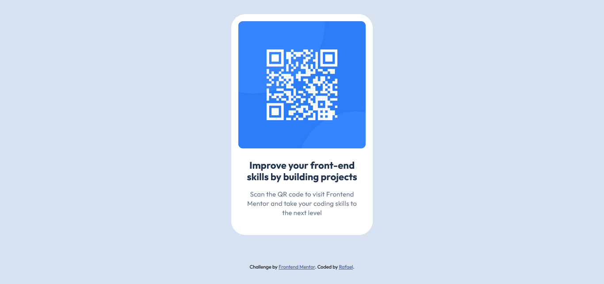

# Frontend Mentor - QR code component solution

This is a solution to the [QR code component challenge on Frontend Mentor](https://www.frontendmentor.io/challenges/qr-code-component-iux_sIO_H). Frontend Mentor challenges help you improve your coding skills by building realistic projects.

## Table of contents

- [Overview](#overview)
  - [Screenshot](#screenshot)
  - [Links](#links)
- [My process](#my-process)
  - [Built with](#built-with)
  - [What I learned](#what-i-learned)
  - [Continued development](#continued-development)
  - [Useful resources](#useful-resources)
- [Author](#author)

## Overview

### Screenshot



### Links

- Check out the solution code and implementation details on GitHub: [Solution URL](https://github.com/rafael-study-repo/qr-code-component)
- You can view the live version of the project here: [Live Site URL](https://rafael-study-repo.github.io/qr-code-component/)

## My process

### Built with

- Semantic HTML5 markup
- CSS custom properties
- CSS Grid
- Git Conventional Commits

### What I learned

This project helped me improve my understanding of the following:

- **Mobile-first design:** I implemented a mobile-first workflow, ensuring that the QR code component is responsive and looks good on both small and large screens.

- **CSS Grid:** I became more comfortable using CSS Grid for layouts, which allowed me to center the QR code and its text content easily.

```css
body {
  display: grid;
  place-items: center;
  min-height: 100vh;
}
```

- **Conventional Commits:** Although not part of the scope of this exercise, I also learned about **Conventional Commits**, a standardized commit message format. It helps maintain a clear history of changes in the project and is useful for automation tools, release management, and collaboration. I adopted this practice in my project, ensuring that my commit messages are consistent and meaningful.

```git
feat: add CSS styling to HTML and restructure folders
fix: correct minor typo in README
```

### Continued development

In the future, I plan to focus on:

- **Semantic HTML & Clean Code:** I want to further improve my HTML skills by ensuring that all pages are structured with semantic tags. This not only improves accessibility but also enhances SEO and the maintainability of my codebase.

- **Performance Optimization:** I'll focus on reducing page load times by optimizing images, using lazy loading, and improving the overall performance of my sites. Ensuring fast loading speeds is crucial for providing a better user experience.

- **Design & Accessibility:** I want to dive deeper into creating accessible websites. This includes ensuring proper color contrast, implementing ARIA roles, and making sure my websites are fully navigable with keyboard shortcuts for better inclusivity.

- **Security Best Practices:** I'll be exploring and implementing security best practices in my projects, such as preventing cross-site scripting (XSS) and ensuring secure data transmission through HTTPS.

### Useful resources

- [How To Center a Div](https://www.joshwcomeau.com/css/center-a-div/) - This article by Josh Comeau provided a comprehensive explanation of various techniques for centering elements in CSS. It was incredibly helpful for understanding the nuances of centering, especially when working with different layout models like Flexbox and Grid.

## Author

- GitHub - [rafael-study-repo](https://github.com/rafael-study-repo)
- Frontend Mentor - [@rafael-study-repo](https://www.frontendmentor.io/profile/rafael-study-repo)